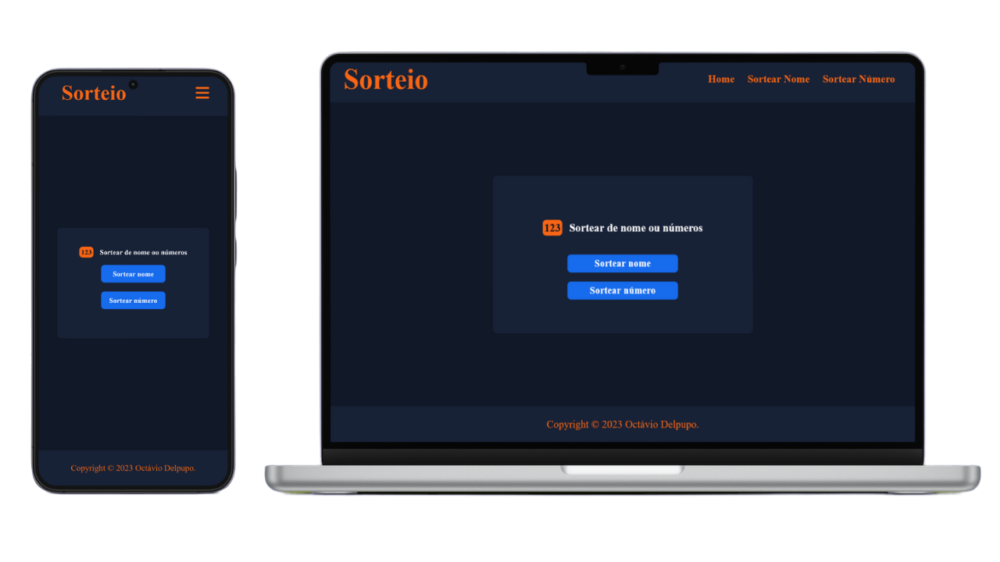

# Sorteio
 
 ## :clipboard: Sobre o Projeto

Clique [aqui](https://sorteio-snowy.vercel.app/) para fazer o seu sorteio.

## :computer: Tecnologias utilizadas

O projeto foi desenvolvido utilizando as seguintes tecnologias:

- HTML
- CSS
- JavaScript

## :closed_book: Licença

Esse projeto está sob a licença MIT. Veja o arquivo [LICENSE](https://github.com/OctavioDelpupo/Churrascometro/blob/main/LICENSE) para mais detalhes.